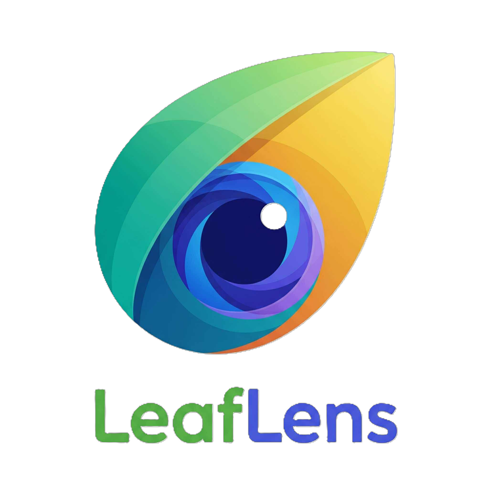

### Dependency List

Install all required dependencies with:

```bash
npm install \
	@capacitor/camera@^6.0.0 \
	@capacitor/core@^6.2.1 \
	@codetrix-studio/capacitor-google-auth@^3.4.0-rc.4 \
	@fortawesome/fontawesome-svg-core@^7.0.1 \
	@fortawesome/free-brands-svg-icons@^7.0.1 \
	@fortawesome/free-regular-svg-icons@^7.0.1 \
	@fortawesome/free-solid-svg-icons@^7.0.1 \
	@fortawesome/react-fontawesome@^3.0.2 \
	axios@^1.12.2 \
	cors@^2.8.5 \
	express@^5.1.0 \
	firebase@^12.3.0 \
	form-data@^4.0.4 \
	framer-motion@^12.23.22 \
	multer@^2.0.2 \
	node-fetch@^3.3.2 \
	react@^19.1.1 \
	react-dom@^19.1.1 \
	react-hook-form@^7.63.0 \
	react-hot-toast@^2.6.0 \
	react-icons@^5.5.0 \
	react-router-dom@^7.9.2
```

For development, also install:

```bash
npm install --save-dev \
	@eslint/js@^9.36.0 \
	@types/react@^19.1.13 \
	@types/react-dom@^19.1.9 \
	@vitejs/plugin-react@^5.0.3 \
	eslint@^9.36.0 \
	eslint-plugin-react-hooks@^5.2.0 \
	eslint-plugin-react-refresh@^0.4.20 \
	globals@^16.4.0 \
	vite@^7.1.7
```

# LeafLens AI 🌱

<p align="center">
	
</p>

**LeafLens AI** is a smart companion for plant identification and care, built with React, Vite, and Firebase. Instantly identify plants, get care guides, chat with an AI botanist, and save your favorites—all in one app!

---

## Features

- 📷 **Scan & Identify Plants**: Use your device camera or upload an image to identify any plant instantly.
- 🪴 **Care Guides**: Get detailed care instructions for your identified plants.
- 🤖 **AI Chatbot**: Ask questions and get advice from our AI plant expert.
- ⭐ **Favorites**: Save your favorite plants for quick access.
- 🔔 **Notifications**: Get plant care and weather notifications.
- 🔒 **Authentication**: Sign in with Google or email/password.

---

## Demo

> _Add a link to your deployed app here (e.g., Vercel, Netlify, etc.)_

---

## Getting Started

### 1. Clone the repository

```bash
git clone https://github.com/Tokise/LeafLens-ai-vercel.git
cd LeafLens-ai-vercel
```

### 2. Install dependencies

```bash
npm install
```

### 3. Set up environment variables

Create a `.env.local` file in the root directory with the following variables:

```env
VITE_FIREBASE_API_KEY=your_firebase_api_key
VITE_FIREBASE_AUTH_DOMAIN=your_firebase_auth_domain
VITE_FIREBASE_PROJECT_ID=your_firebase_project_id
VITE_FIREBASE_STORAGE_BUCKET=your_firebase_storage_bucket
VITE_FIREBASE_MESSAGING_SENDER_ID=your_firebase_messaging_sender_id
VITE_FIREBASE_APP_ID=your_firebase_app_id
VITE_FIREBASE_MEASUREMENT_ID=your_firebase_measurement_id
VITE_OPENROUTER_API_KEY=your_openrouter_api_key
VITE_WEATHER_API_KEY=your_openweathermap_api_key
VITE_PLANTID_API_KEY=your_plantid_api_key
```

> _You can get these keys from your Firebase, OpenRouter, OpenWeatherMap, and Plant.id accounts._

### 4. Start the development server

```bash
npm run dev
```

The app will be available at [http://localhost:5173](http://localhost:5173).

---

## PlantNet Proxy (Optional for PlantNet API)

If you want to use the PlantNet API, run the included Node.js proxy:

```bash
node plantnet-proxy.cjs
```
This will start a proxy server at `http://localhost:5000/api/plantnet`.

---

## Build for Production

```bash
npm run build
```

---

## Deployment

- The app is ready to deploy on Vercel, Netlify, or any static hosting.
- For Vercel, see `vercel.json` for rewrite rules.

---

## Tech Stack

- React 19 + Vite
- Firebase (Auth, Firestore, Messaging)
- OpenRouter (AI Chat)
- Plant.id API (Plant identification)
- OpenWeatherMap (Weather notifications)
- Capacitor (Camera, Google Auth for Android)
- Express (PlantNet proxy)

---

## Folder Structure

```
src/
	assets/           # Images, SVGs, logo
	components/       # Reusable UI components
	context/          # Theme context
	css/              # CSS files
	firebase/         # Firebase config and modules
	pages/            # App pages (Home, Scan, Favorites, etc.)
	utils/            # Utility functions/services
public/
	...               # Static files, service workers
```

---

## Required Services & APIs

- **Firebase**: Auth, Firestore, Messaging
- **OpenRouter**: AI chat API key
- **OpenWeatherMap**: Weather API key
- **Plant.id**: Plant identification API key
- **PlantNet**: (Optional) Use included proxy for PlantNet API

---

## Installation Notes

- Make sure to use **Node.js 18+** and **npm 9+**.
- For camera access, use HTTPS or localhost.
- For push notifications, configure Firebase Messaging and service worker (`public/firebase-messaging-sw.js`).
- For Android WebView (Median), Capacitor plugins are used for camera and Google Auth.

---

## License

MIT
